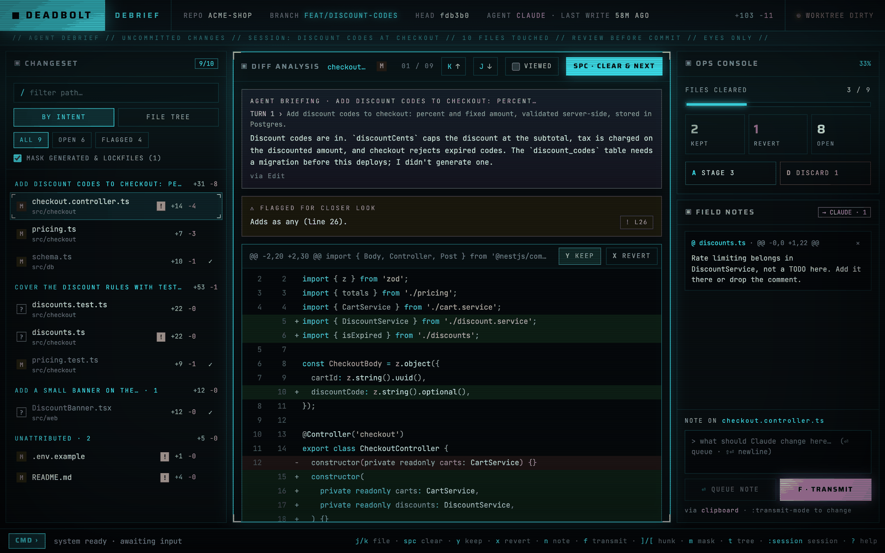
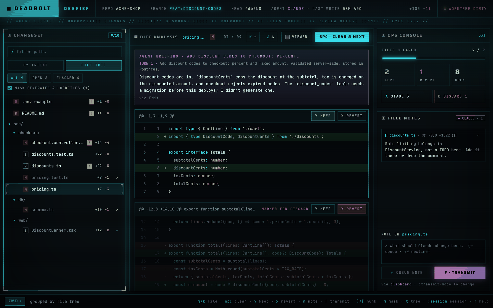
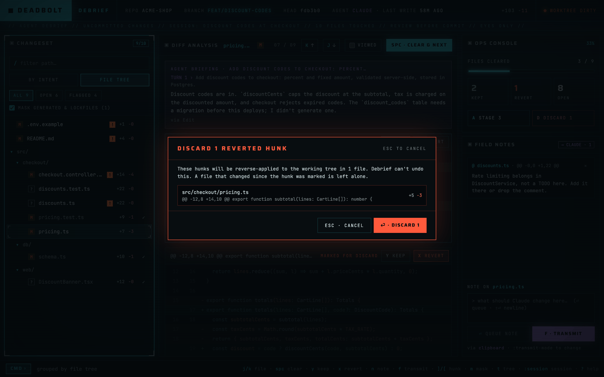
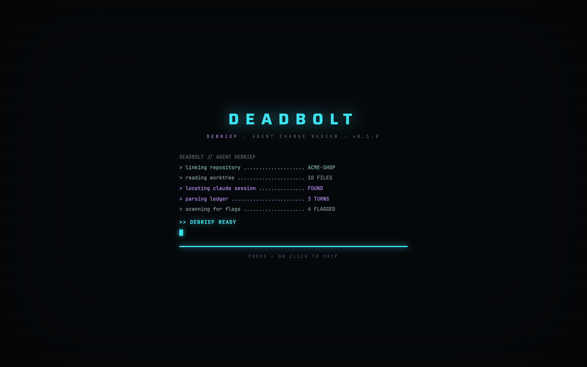

# Debrief

A desktop app for reviewing what a Claude Code session changed in your working tree before you commit.

Debrief reads the repo's uncommitted changes and the session's transcript under `~/.claude/projects`, groups the files by the prompt that produced them, flags what needs a closer look, and lets you clear files, keep or revert hunks, stage what you cleared and send one batch of notes back to Claude. Review state lives in `.git/debrief/`, never in the working tree.



## Features

- **Grouped by intent.** Files are grouped by the prompt that changed them. Your own edits show under UNATTRIBUTED, and lockfiles and generated files are masked.
- **Flags.** Unattributed changes, `TODO` / `as any` / `.only(` markers, removed tests, `.env` changes and possible secrets (only the pattern name, never the value), conflict markers and large changes.
- **Keyboard review.** Clear a file and jump to the next open one, keep or revert single hunks. A cleared file goes back to open when it changes again.
- **Stage and discard.** Stage cleared files without the hunks you marked for revert; discard reverted hunks from the working tree after a confirmation.
- **Notes back to Claude.** Write notes on files or hunks and send them as one prompt: to the clipboard, to `.git/debrief/feedback.md`, or straight into the session with `claude --resume`.

## Screenshots

**File tree, with a kept hunk and a hunk marked for revert (dimmed)**



**Discard asks first and lists every hunk it will rewrite**



**Boot**



<sub>The repo and session in these screenshots are a made-up demo.</sub>

## Install

Download the DMG from [Releases](https://github.com/sarasate/debrief/releases) (Apple Silicon only) and drag **debrief** to Applications.

The app isn't signed or notarized, so macOS blocks the first launch. Right-click the app → **Open** → **Open**, or run:

```
xattr -dr com.apple.quarantine /Applications/debrief.app
```

## Usage

Open a repository with `⌘O`. Debrief remembers it and picks up the newest Claude Code session for it, refreshing as Claude or you write files.

| Key | Action |
|---|---|
| `space` | Clear the file, go to the next open one |
| `y` / `x` | Keep / revert the hunk under the cursor |
| `J` / `K`, `]` / `[` | Next / previous file, hunk |
| `n` | Note on the hunk (or file) |
| `f` | Transmit notes to Claude |
| `a` / `d` | Stage cleared files / discard reverted hunks |
| `t` | Group by intent ↔ file tree |
| `:` | Palette: `:session`, `:transmit-mode`, `:accent`, `:scanlines`, `:claude-path` |
| `?` | Every key |

A `.debrief.toml` at a repo root overrides which files count as generated:

```toml
[noise]
extra = ["**/*.generated.cs"]   # add to the defaults
# globs = ["*.lock"]            # or replace them
```

## Development

Tauri 2 (Rust) with React 19, TypeScript, Vite and Tailwind.

```
pnpm install
pnpm tauri dev            # dev server on port 1430
pnpm tauri build          # .app and .dmg in src-tauri/target/release/bundle
cd src-tauri && cargo test
pnpm tsc --noEmit
```

- `docs/SPEC.md`: product and technical spec
- `docs/PLAN.md`: build milestones
- `design/`: the design prototype and the app icon source (`scripts/make-icon.py`)
